# Spotify Popularity Analysis

## Presentation Video

[link](https://youtu.be/_tz_rdLHZOI)

---

## How to Build and Run

This project is fully reproducible through the provided `Makefile`.

```bash
make install
make run
```

`make install` installs the required Python packages listed in `requirements.txt`.

`make run` executes the notebook `eda.ipynb` using `nbconvert`, so the full analysis can be reproduced from beginning to end.

---

## Project Overview

My project focuses on analyzing and predicting song popularity on Spotify using audio features like danceability, energy, loudness, acousticness, valence, tempo, and genre.

This project is not only about building a model. It is also about understanding the dataset and explaining why the model behaves the way it does. I first clean the data, then explore the target variable and feature relationships. After that, I build regression models to predict the popularity score and classification models to identify highly popular songs. Finally, I compare the model results and use feature importance to understand which variables are more useful.

The main question behind the project is:

**Can Spotify audio features and genre information explain or predict song popularity?**

---

## Dataset Description

Each row in the dataset represents one Spotify track. The dataset includes basic song information such as artist, album, track name, and genre, as well as Spotify audio features.

The target variable is `popularity`, which is a score from 0 to 100. A higher score means the song is more popular on Spotify.

The important feature groups are:

- **Basic metadata:** artists, album name, track name, genre
- **Audio features:** danceability, energy, loudness, speechiness, acousticness, instrumentalness, liveness, valence, tempo
- **Song properties:** duration, explicit label
- **Target variable:** popularity

For modeling, I mainly focus on measurable audio features and encoded genre. I avoid using high-cardinality text fields such as track name and artist name in the baseline model because they may add noise or cause overfitting.

---

## Data Cleaning

The raw dataset has 114,000 rows and 21 columns. Most audio features are already numeric, while columns such as `artists`, `album_name`, `track_name`, and `track_genre` are text-based.

Before modeling, I clean the dataset because the raw data contains an unnecessary index column, a few missing values, and duplicated rows.

The cleaning process includes:

- removing the unnecessary `Unnamed: 0` column,
- dropping rows with missing values,
- removing duplicate rows,
- converting `explicit` into 0/1 values,
- encoding `track_genre` into a numeric genre code.

After cleaning, the dataset decreases from 114,000 rows to 113,549 rows.

This means the cleaning step removes only a small part of the dataset, so most of the original information is preserved. The final dataset has no duplicate rows, and the target variable `popularity` is still available for both regression and classification modeling.

---

## Exploratory Data Analysis

### Popularity Distribution

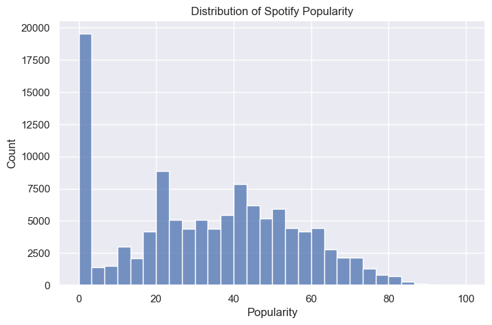

Popularity is the main target in this project. I first look at its distribution because the shape of the target variable affects how difficult the prediction task will be.

This histogram shows that Spotify popularity is not evenly distributed.

The average popularity score is about 33.3, and the median is 35. Most songs are in the low-to-medium popularity range. The 75th percentile is 50, which means about 75% of songs have popularity scores of 50 or below. Very high popularity songs are much less common.

This is important because the model will see many more average or low-popularity songs than extremely popular songs. As a result, predicting highly popular songs is a harder task than predicting normal songs.

This also explains why regression models may tend to predict values closer to the middle range instead of extreme popularity scores.

---

### Genre Overview

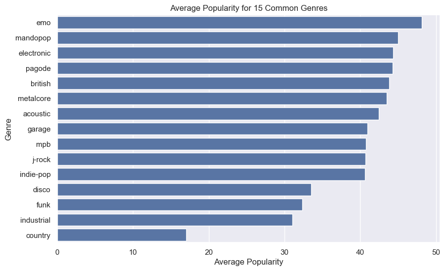

Genre is an important variable because different genres may have different audiences and different average popularity levels.

Here I compare the average popularity of the 15 most common genres in the dataset. I use the most common genres so the comparison is based on enough songs and the chart stays readable.

This bar chart shows that genre does matter, but it does not completely explain popularity.

Among the common genres shown here, `emo` has the highest average popularity at about 48.1, followed by genres such as `mandopop`, `electronic`, and `pagode`. On the lower end, `country` has an average popularity of about 17.0 in this subset.

The gap between genres suggests that genre can be useful for prediction. However, each genre still contains many songs with different popularity levels, so genre alone cannot determine whether a song will be popular.

This finding becomes important later because `track_genre_code` becomes the strongest feature in the Random Forest feature importance plot.

---

### Correlation Analysis

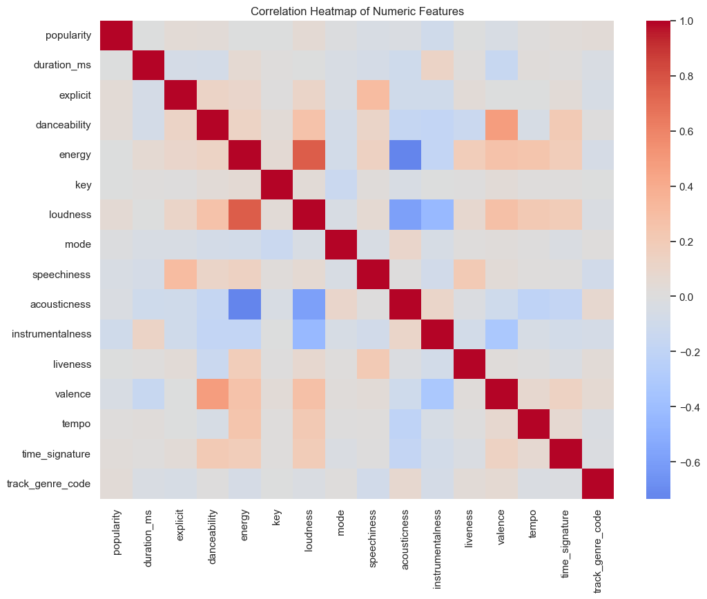

A correlation heatmap helps show whether any numeric feature has a strong linear relationship with popularity.

This is useful as a first check, but correlation only captures linear relationships. A feature can still be useful for a nonlinear model even if its simple correlation with popularity is weak.

The correlation results show that no single audio feature has a strong linear relationship with popularity.

The strongest positive correlations with popularity are still very small, such as loudness at about 0.047, explicit at about 0.044, and danceability at about 0.034. Instrumentalness has the strongest negative correlation at about -0.095.

This means popularity cannot be explained well by one audio feature alone. The model needs to combine many weak signals, and nonlinear models may perform better than a simple linear model.

This result also helps explain why Linear Regression performs poorly later in the modeling section. Since the linear relationships are weak, a simple linear model cannot capture much of the variation in popularity.

---

## Feature Engineering

I create a few simple engineered features based on the original columns:

- `log_duration`: a log transform of song length,
- `energy_loudness`: an interaction feature between energy and loudness,
- `is_popular`: a binary label for classification (`popularity >= 70`).

The threshold of 70 is used to define highly popular songs. This creates a stricter classification task because only songs with clearly high popularity scores are labeled as popular.

The new `is_popular` label shows a major class imbalance.

Only about 4.8% of songs are labeled as popular, while about 95.2% are not popular. This is a key finding because it means accuracy can be misleading in the classification task. For example, a model could predict almost every song as not popular and still get high accuracy.

Because of this, I also need to look at recall, precision, F1-score, confusion matrices, and later SMOTE / threshold tuning.

---

## Modeling Setup

For the first round of models, I use audio features, engineered features, and encoded genre.

The selected feature matrix has 17 features. I exclude text metadata such as track name, artist, and album name because these values are very specific and high-cardinality. For a baseline model, using them directly may add noise or cause overfitting.

For regression, the target is the original 0–100 popularity score. For classification, the target is the binary `is_popular` label.

The classification split uses stratification so the training and testing sets keep the same imbalance pattern. This matters because only around 4.8% of the songs are popular. Without stratification, the test set could accidentally have too many or too few popular songs, making the evaluation less reliable.

---

## Regression Task: Predict Popularity

I compare two regression models:

- Linear Regression as a simple baseline,
- Random Forest Regressor as a nonlinear model.

This comparison helps show whether popularity is mostly explained by simple linear relationships or whether a more flexible model is needed.

The regression results show that Random Forest performs much better than Linear Regression.

Linear Regression has an RMSE of about 22.08 and an R² of about 0.028. This means the linear model explains very little of the variation in popularity. This matches the correlation analysis, where individual audio features had weak linear relationships with popularity.

Random Forest improves the RMSE to about 16.43 and the R² to about 0.462. This means the nonlinear model captures more useful patterns in the data. However, the R² is still far from 1, so the model is not highly accurate. Popularity is likely affected by outside factors such as artist fame, playlist placement, release timing, marketing, and social media trends.

---

## Regression Diagnostics

Besides looking at RMSE and R², I also check the actual-vs-predicted plot and the residual plot.

The actual-vs-predicted plot shows whether predictions are close to the real popularity scores. The residual plot shows the prediction errors, where residual = actual popularity − predicted popularity.

### Actual vs Predicted Popularity

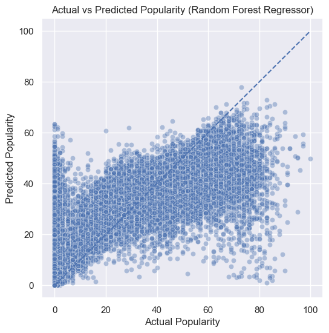

The actual-vs-predicted plot shows that the model captures the general direction but still has noticeable error.

If the model were very accurate, the points would be close to the diagonal line. In this case, many points are spread away from the line, meaning the model sometimes overpredicts or underpredicts popularity.

The pattern also shows that the model is better at predicting common mid-range popularity values than extreme values. This matches the popularity distribution, where extreme popularity scores are less common in the dataset.

### Residual Distribution

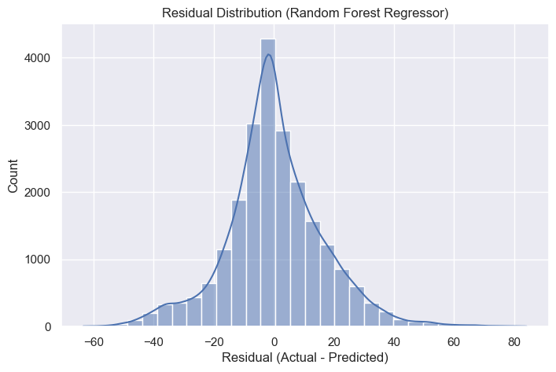

The residuals are mostly centered around 0, which means the model is not consistently too high or too low.

However, the spread is still wide. This means the model still makes significant errors for many songs. So the model is reasonable, but it is not strong enough to precisely predict popularity for every song.

This is an important distinction: residuals being centered around 0 means the model is not strongly biased, but it does not mean the model is very accurate. The wide spread shows that prediction errors are still large.

---

## Classification Task: Predict High Popularity

Next, I convert the problem into classification by predicting whether a song is highly popular (`popularity >= 70`).

I compare Logistic Regression and Random Forest Classifier. Since popular songs are rare in this dataset, I focus on precision, recall, and F1-score instead of accuracy alone.

### Confusion Matrix - Logistic Regression

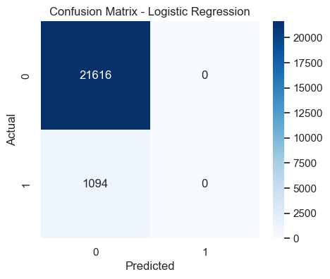

The classification results show why accuracy alone is not enough for this project.

Logistic Regression gets about 95% accuracy, but it predicts almost no popular songs correctly. Its recall and F1-score for the popular class are 0. This happens because the dataset is highly imbalanced, and the model learns that predicting the majority class is usually safe.

So even though the accuracy looks high, the model fails at the actual goal of identifying highly popular songs.

### Confusion Matrix - Random Forest Classifier

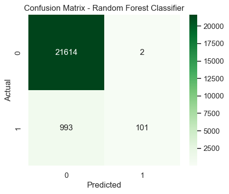

Random Forest performs better than Logistic Regression. It still has high accuracy, but more importantly, it starts identifying some popular songs.

However, its recall for the popular class is only about 0.10, meaning it still misses most popular songs. This shows that the imbalance problem needs to be handled more directly.

This result connects back to the class distribution: because only about 4.8% of songs are popular, the classifier needs extra help to learn the minority class.

---

## Handling Class Imbalance and Tuning the Classifier

Since only about 4.8% of songs are labeled as popular, I use SMOTE to balance the training data.

SMOTE creates synthetic examples of the minority class in the training set. The goal is to help the classifier learn the patterns of popular songs instead of mostly learning the non-popular class.

### Confusion Matrix - Random Forest with SMOTE

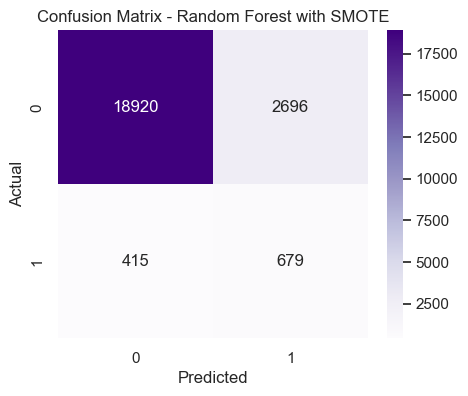

After applying SMOTE, the training set becomes balanced: the popular and non-popular classes have the same number of samples.

The SMOTE model improves recall for popular songs to about 0.62, meaning it finds many more popular songs than the original Random Forest. However, precision drops to about 0.20, meaning many songs predicted as popular are actually not popular.

This is a tradeoff: SMOTE helps the model catch more popular songs, but it also creates more false positives.

GridSearchCV improves the Random Forest classifier by testing different parameter combinations.

The tuned model uses `n_estimators = 200`, `max_depth = None`, and `min_samples_leaf = 1`. Compared with the basic SMOTE model, the tuned model gives a better balance: popular-class precision increases to about 0.43 and recall is about 0.59, giving an F1-score around 0.50.

This is a stronger result because it finds many popular songs while making fewer false-positive mistakes than the untuned SMOTE model.

### Precision-Recall Curve

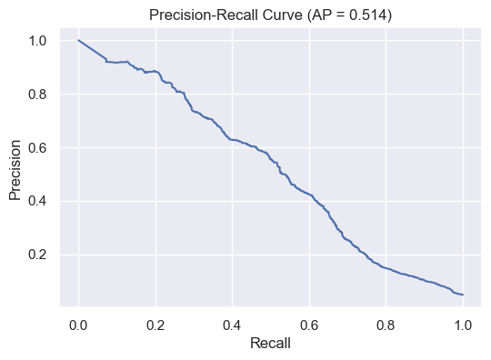

The precision-recall curve is useful because this dataset has far fewer popular songs than non-popular songs.

Instead of only looking at one threshold, this curve shows how precision and recall change across many thresholds. A higher average precision means the model is better at ranking songs by the probability of being popular.

This helps decide whether the model should be stricter or more flexible when labeling a song as popular.

In this project, this curve supports the idea that there is no perfect threshold. A lower threshold can increase recall and find more popular songs, but it also lowers precision and creates more false positives.

### Confusion Matrix - Tuned Threshold

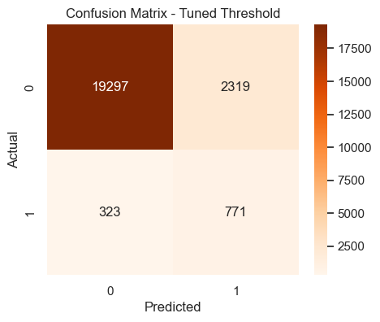

Lowering the threshold to 0.30 makes the model more willing to classify songs as popular.

With this threshold, recall for the popular class increases to about 0.70, so the model misses fewer popular songs. However, precision drops to about 0.25, meaning more non-popular songs are incorrectly labeled as popular.

This version is useful if the goal is to find as many potentially popular songs as possible. If the goal is to avoid false positives, the default or tuned threshold would be better.

This shows that classification is not only about choosing the best model. It also depends on the practical goal: whether we care more about finding popular songs or avoiding incorrect popular predictions.

---

## Feature Importance

I use Random Forest feature importance to understand which variables contribute most to the regression model.

This is not a perfect explanation of causation, but it helps show which features the model relies on most when predicting popularity.

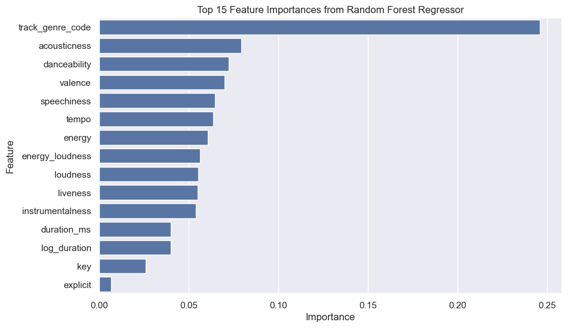

The feature importance plot shows that `track_genre_code` is the most important feature in the Random Forest regression model, with an importance of about 0.246.

This suggests that genre is one of the strongest signals in this dataset. Audio features such as acousticness, danceability, valence, speechiness, tempo, energy, and loudness also contribute, but each one individually has much smaller importance.

This matches the earlier results: popularity is not explained by one audio feature, but a combination of genre and multiple audio characteristics helps the model make better predictions.

This also explains why Random Forest performs better than Linear Regression. Random Forest can combine many weak features and capture nonlinear relationships, while Linear Regression depends more on simple linear trends.

---

## Conclusion

Overall, this project shows that Spotify audio features provide some useful information about song popularity, but they are not enough to fully predict it.

The data analysis shows that popularity is concentrated mostly in the low-to-medium range, with relatively few highly popular songs. The correlation analysis also shows that individual audio features have weak linear relationships with popularity. Because of this, Linear Regression performs poorly, while Random Forest performs better by capturing nonlinear patterns.

For classification, the biggest challenge is class imbalance. Only about 4.8% of songs are labeled as highly popular, so a simple model can get high accuracy while failing to identify popular songs. SMOTE, tuning, and threshold adjustment improve the model’s ability to find popular songs, but they also introduce tradeoffs between precision and recall.

The feature importance analysis shows that genre is the strongest predictor in this dataset, while individual audio features each contribute smaller pieces of information. This supports the main conclusion that popularity is not controlled by one feature. Instead, it depends on genre, multiple audio characteristics, and likely many external factors.

In future work, I could improve the project by adding artist-level popularity, release date, playlist information, recent streaming trends, and social media features. These external factors are likely important because song popularity depends on more than audio characteristics alone.

---

## Reproducibility

This project includes:

- `Makefile` for running the notebook,
- `requirements.txt` for dependencies,
- `eda.ipynb` for the full analysis,
- exported figures in `notebooks/plots/`.
